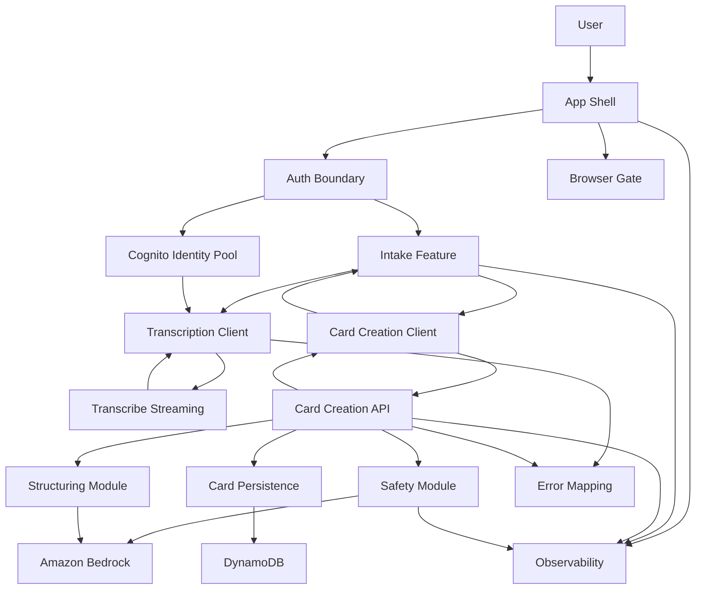
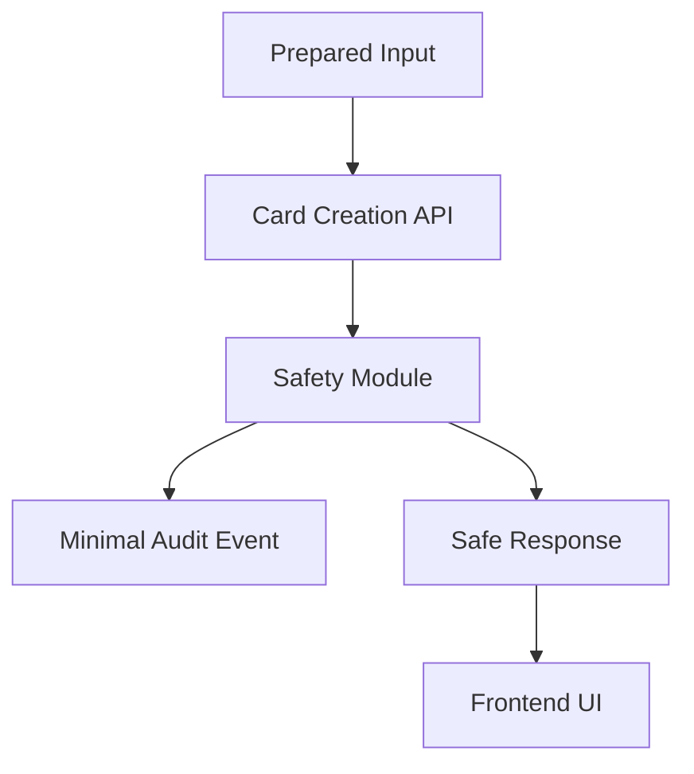

# コンポーネント依存関係

## 目的

この文書は、コンポーネント間の依存関係、通信パターン、主要データフローを定義する。

## 依存関係マトリクス

| From | To | 関係 | 通信/呼び出し |
|---|---|---|---|
| App Shell and Routing | Auth Boundary | 認証状態に基づく表示制御 | React context/hook |
| App Shell and Routing | Browser Support Gate | Chrome gate 適用 | synchronous function |
| App Shell and Routing | Intake Feature | コア入力画面表示 | React composition |
| Auth Boundary | Cognito User Pool | Google ログイン | Amplify Auth |
| Auth Boundary | Cognito Identity Pool | AWS 一時クレデンシャル取得 | Amplify/Auth credentials |
| Intake Feature | Transcription Client | 音声文字起こし | browser direct streaming |
| Intake Feature | Card Creation Client | prepared input 送信 | async API call |
| Transcription Client | Amazon Transcribe Streaming | 日本語音声文字起こし | WebSocket/streaming API |
| Card Creation Client | Card Creation API | Card 作成要求 | AppSync custom mutation or equivalent backend API |
| Card Creation API | Safety Guardrail Module | safety 判定 | in-process module call |
| Card Creation API | Structuring Module | AI 構造化 | in-process module call |
| Card Creation API | Card Persistence | 保存 | AppSync/Amplify Data/DynamoDB access |
| Safety Guardrail Module | Bedrock Guardrails | unsafe-domain 判定 | AWS SDK/Bedrock |
| Structuring Module | Amazon Bedrock Claude | Card 候補生成 | Anthropic Bedrock SDK |
| Card Persistence | DynamoDB | Card 保存/取得 | Amplify Data/AppSync generated access |
| All components | Observability Module | イベント/ログ/メトリクス | shared module |
| All components | Error Mapping | safe error 変換 | shared module |

## 通信パターン

| Pattern | 用途 | 方針 |
|---|---|---|
| React composition | UI shell と feature UI | App Shell が auth/browser 状態で表示を切り替える |
| Browser direct streaming | 音声文字起こし | Cognito Identity Pool の authenticated role で Transcribe Streaming に直接接続する |
| Backend trusted operation | Card 作成 | フロントエンドは単一 API を呼び、backend が safety/structuring/persistence を担当する |
| In-process backend modules | safety と structuring の分離 | 外部 API は単一にしつつ、内部モジュールで責務を分ける |
| Owner-scoped data access | Card 保存/一覧 | Cognito `sub` を owner identity とし、owner authorization を適用する |
| Central observability | 計測/ログ | すべての機能が共通 event schema と logger を利用する |
| Typed error mapping | エラー表示 | backend/system error を safe UI error に変換する |

## データフロー図

### Mermaid Diagram

### Text Alternative

1. User opens the React App Shell.
2. App Shell applies Browser Gate and Auth Boundary.
3. Auth Boundary uses Cognito User Pool for Google login and Identity Pool for AWS temporary credentials.
4. Intake Feature handles voice or text input.
5. Voice input uses Transcription Client to connect directly to Transcribe Streaming.
6. Prepared text is sent through Card Creation Client to Card Creation API.
7. Card Creation API runs Safety Module first.
8. If safety blocks, no Card is persisted; only safe response and minimal audit/metric event are returned.
9. If safety allows, Structuring Module calls Bedrock Claude and validates the result.
10. Card Persistence saves owner-scoped Card to DynamoDB.
11. Observability and Error Mapping are used across frontend and backend.

## Guardrail 発火時のデータフロー

### Text Alternative

1. 入力テキストは Card Creation API に送信される。
2. Safety Module が guardrail 判定を行う。
3. 発火した場合、Card は保存しない。
4. ユーザーテキストや Card データを含まない最小限の audit/metric event だけ送る。
5. UI には安全な応答を表示する。

## 依存関係制約

- フロントエンドは Card を直接永続化しない。
- フロントエンドは AI 構造化結果を信頼しない。保存判断は backend が行う。
- Safety Module は Structuring Module より前に実行する。
- Card Persistence は owner identity を必須入力にする。
- Observability Module は入力全文、email、token、secret を受け取らない。
- Error Mapping は内部例外をそのまま UI に渡さない。

## Security Baseline 準拠

この依存関係では、認証、認可、入力検証、安全判定、永続化、ログ抑制を信頼境界内に置く。
具体的な IAM policy、CORS、暗号化、ログ保持、security headers は NFR Design と Infrastructure Design で詳細化する。

## PBT 準拠

Application Design では PBT は N/A。
後続では、typed error mapping、schema parsing、view model mapping、observability event schema を PBT Partial の候補として扱う。
