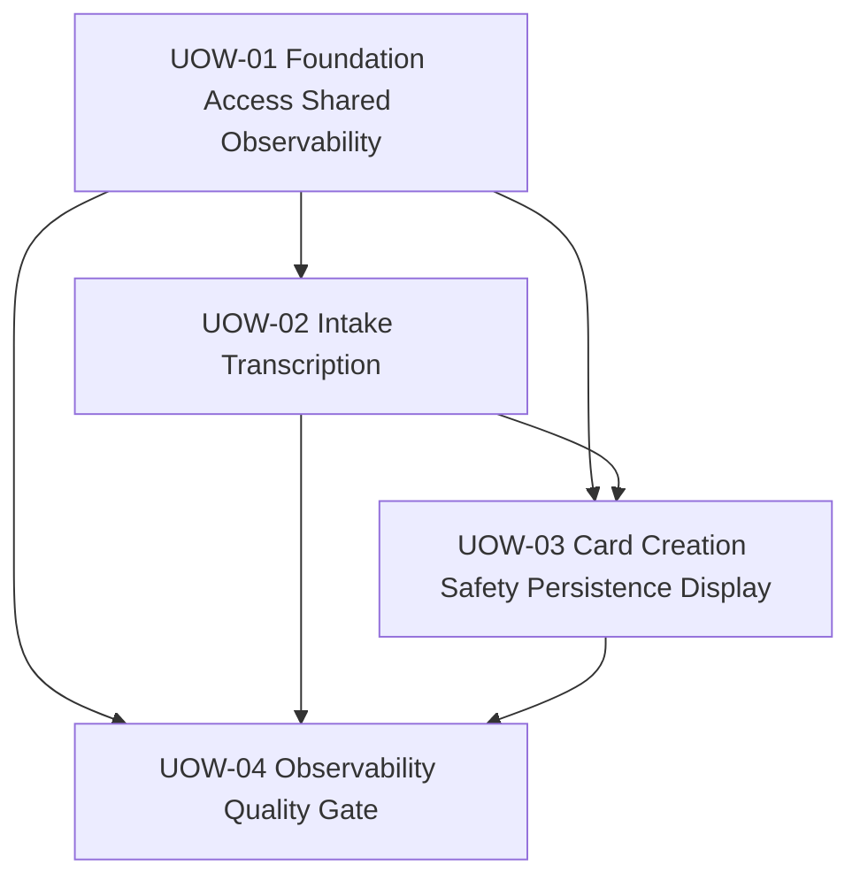

# ユニット依存関係

## 1. 概要

この文書は Units Generation で確定した Unit of Work 間の依存関係を定義する。
Tebanashi 初期開発は単一アプリケーション内の論理ユニットとして実装するため、ここでの依存は deployable service 間依存ではなく、設計・実装・テスト順序の依存である。

## 2. 依存関係サマリー

| From | Depends On | 理由 |
|---|---|---|
| UOW-01 Foundation, Access, and Shared Observability Foundation | None | すべての後続ユニットが auth、owner identity、Chrome gate、共通 error/observability contract を使う |
| UOW-02 Intake and Transcription | UOW-01 | authenticated identity、Identity Pool/IAM 前提、app shell、error/observability foundation が必要 |
| UOW-03 Card Creation, Safety, Persistence, and Display | UOW-01, UOW-02 | owner identity と prepared input contract が必要。Card 表示は app shell に依存する |
| UOW-04 Observability and Quality Gate | UOW-01, UOW-02, UOW-03 | 全ユニットのイベント、ログ、E2E、PBT、Security/NFR を横断確認する |

## 3. 依存マトリクス

| Unit | UOW-01 | UOW-02 | UOW-03 | UOW-04 |
|---|---|---|---|---|
| UOW-01 Foundation, Access, and Shared Observability Foundation | Self | Provides auth/owner/obs foundation | Provides auth/owner/obs foundation | Provides baseline contracts |
| UOW-02 Intake and Transcription | Depends | Self | Provides prepared input | Provides intake metrics and scenarios |
| UOW-03 Card Creation, Safety, Persistence, and Display | Depends | Depends | Self | Provides card/safety/persistence metrics and scenarios |
| UOW-04 Observability and Quality Gate | Depends | Depends | Depends | Self |

## 4. Mermaid Diagram

## 5. Text Alternative

1. UOW-01 を最初に実装し、認証、owner identity、Chrome gate、共通 error/observability contract を準備する。
2. UOW-02 は UOW-01 の認証済み identity と app shell を使い、voice/text input から `PreparedInputText` を作る。
3. UOW-03 は UOW-01 の owner identity と UOW-02 の prepared input contract を使い、safety-first Card creation、保存、表示を完成させる。
4. UOW-04 は UOW-01 から UOW-03 の成果を横断し、観測性、E2E、PBT、Security/NFR の品質ゲートを完成させる。

## 6. 主要 contract 依存

| Contract | Producer | Consumer | Notes |
|---|---|---|---|
| `OwnerIdentity` | UOW-01 | UOW-02, UOW-03, UOW-04 | Cognito `sub` を主識別子とする。email は永続化しない |
| `AuthState` | UOW-01 | UOW-02, UOW-03 | 未認証時に core experience を止める |
| `BrowserSupportResult` | UOW-01 | UOW-02, UOW-03, UOW-04 | Chrome gate の判定結果 |
| `PreparedInputText` | UOW-02 | UOW-03 | voice/text の入力由来を統一する |
| `CreateCardRequest` / `CreateCardResponse` | UOW-03 | UOW-02, UOW-04 | backend source-of-truth schema から生成/共有される |
| `Card` / `CardStatus` | UOW-03 | UOW-03, UOW-04 | `active` と `needs_attention` の区別を保持する |
| `SafetyDecision` | UOW-03 | UOW-03, UOW-04 | Safety は Card creation flow 内の内部 contract |
| `ObservabilityEvent` | UOW-01 | All units | UOW-04 で completeness と PII 抑制を検証する |
| `AppError` / `SafeUiError` | UOW-01 | All units | 各ユニットが詳細 code を追加し、UOW-04 で横断確認する |

## 7. 実装順序と統合方針

### 7.1 Thin vertical slice

最初の pass では text fallback を使って、次の最短経路を通す。

1. UOW-01: authenticated Chrome user が app shell に到達する。
2. UOW-02: text input から `PreparedInputText` を作る。
3. UOW-03: prepared input を Card Creation API に渡し、最小 Card を保存して list に表示する。

この pass では、外部依存の詳細を段階的に厚くする。
AI/Bedrock、Guardrails、Transcribe の本実装は、contract を壊さずに後続 pass で追加する。

### 7.2 Safety integration

Safety は UOW-03 内で必ず Structuring より前に実行する。
UOW-03 の外に safety-only unit は作らない。
ただし UOW-04 は safety event、safe response、E2E scenario を横断確認する。

### 7.3 Observability integration

UOW-01 が薄い event schema と logging rule を置く。
UOW-02 と UOW-03 が自分のイベントを発行する。
UOW-04 が必須イベントの completeness、PII 抑制、p95/success-rate 算出可能性を検証する。

## 8. 依存制約

- UOW-02 は UOW-03 の内部 backend implementation に依存しない。依存するのは `PreparedInputText` と Card creation client contract のみである。
- UOW-03 は UOW-02 の UI state に依存しない。依存するのは prepared input contract のみである。
- UOW-03 の Safety Module は Structuring Module と Card Persistence より前に実行されなければならない。
- UOW-03 の Card Persistence は owner identity を必須入力にする。
- UOW-04 は機能を新設するのではなく、各ユニットの instrumentation、testability、quality gate を補完する。

## 9. リスクと緩和

| Risk | Affected Units | Mitigation |
|---|---|---|
| Bedrock/Guardrails の latency が p95 8 秒を超える | UOW-03, UOW-04 | UOW-03 で latency event を発行し、UOW-04 で p95 を算出可能にする |
| Transcribe browser behavior が不安定 | UOW-02, UOW-04 | text fallback を必須にし、voice failure recovery と E2E scenario を用意する |
| owner authorization の抜け漏れ | UOW-01, UOW-03 | owner identity contract と persistence authorization を分けて検証する |
| guardrail false negative/positive | UOW-03, UOW-04 | Bedrock Guardrails とアプリ側分類の両方を通し、safe response E2E を追加する |
| ログへの PII 混入 | All units | UOW-01 の event schema と UOW-04 の横断検証で抑止する |

## 10. 後続ステージへの引き継ぎ

- Functional Design は UOW-01 から UOW-04 の順に詳細化する。
- NFR Requirements/NFR Design は UOW-04 だけでなく、各ユニットの受け入れ条件にも反映する。
- Infrastructure Design は UOW-01 と UOW-03 の AWS resource/IAM 境界を特に重視する。
- Code Generation は各ユニットで TDD の探索、Red、Green、Refactoring を実行する。
