# Execution Plan

## 1. Detailed Analysis Summary

### Project Type

- **Project Type**: Greenfield
- **Approved Initial Scope**: 音声/テキスト入力から AI によるやめ候補作成・保存・表示まで
- **Primary Artifacts Loaded**:
  - `aidlc-docs/inception/requirements/requirements.md`
  - `aidlc-docs/inception/requirements/requirement-verification-questions.md`
  - `aidlc-docs/inception/user-stories/stories.md`
  - `aidlc-docs/inception/user-stories/personas.md`

### Change Impact Assessment

| Impact Area | Assessment |
|---|---|
| User-facing changes | Yes. Google sign-in, Chrome gate, voice/text intake, AI card output, card list, safety response, and error/fallback UX are user-visible. |
| Structural changes | Yes. New React frontend, Amplify Gen 2 backend, Cognito auth, AppSync/DynamoDB data, Lambda AI functions, Transcribe integration, observability are required. |
| Data model changes | Yes. New Card model is required; WithdrawalEvent is designed for future units but not initial code focus. |
| API changes | Yes. GraphQL/AppSync mutations and queries are required for Card persistence/listing; Lambda function contracts are required for AI structuring and guardrails. |
| NFR impact | Yes. Security, privacy, p95 latency, success-rate measurement, accessibility, logging, rate limits, and PBT constraints all apply. |

### Risk Assessment

| Item | Assessment |
|---|---|
| Risk Level | High |
| Rollback Complexity | Moderate |
| Testing Complexity | Complex |
| Primary Risk Drivers | Bedrock/Guardrails latency, Transcribe browser behavior, Cognito/owner authorization, safety false negatives/false positives, observability requirements |

### Key Planning Consequences

- Application Design is required because new frontend/backend components, service boundaries, AI contracts, and data ownership rules need definition.
- Units Generation is required because the work spans authentication/platform shell, intake UX, AI structuring, persistence, safety, and observability.
- Functional Design is required per unit because business rules include guardrail handling, schema validation, data ownership, fallback behavior, and user-visible acceptance criteria.
- NFR Requirements and NFR Design are required because security, privacy, accessibility, latency, monitoring, and PBT obligations are explicit requirements.
- Infrastructure Design is required because the system depends on AWS serverless resources and IAM boundaries.

## 2. Workflow Visualization

### Mermaid Diagram

```mermaid
flowchart TD
    Start([User Request])

    subgraph INCEPTION[INCEPTION PHASE]
        WD[Workspace Detection<br/><b>COMPLETED</b>]
        RE[Reverse Engineering<br/><b>SKIPPED</b>]
        RA[Requirements Analysis<br/><b>COMPLETED</b>]
        US[User Stories<br/><b>COMPLETED</b>]
        WP[Workflow Planning<br/><b>IN PROGRESS</b>]
        AD[Application Design<br/><b>EXECUTE</b>]
        UG[Units Generation<br/><b>EXECUTE</b>]
    end

    subgraph CONSTRUCTION[CONSTRUCTION PHASE]
        FD[Functional Design<br/><b>EXECUTE</b>]
        NFRA[NFR Requirements<br/><b>EXECUTE</b>]
        NFRD[NFR Design<br/><b>EXECUTE</b>]
        ID[Infrastructure Design<br/><b>EXECUTE</b>]
        CG[Code Generation<br/><b>EXECUTE</b>]
        BT[Build and Test<br/><b>EXECUTE</b>]
    end

    subgraph OPERATIONS[OPERATIONS PHASE]
        OPS[Operations<br/><b>PLACEHOLDER</b>]
    end

    Start --> WD
    WD --> RE
    RE --> RA
    RA --> US
    US --> WP
    WP --> AD
    AD --> UG
    UG --> FD
    FD --> NFRA
    NFRA --> NFRD
    NFRD --> ID
    ID --> CG
    CG --> BT
    BT --> OPS
    BT --> End([Complete])

    style WD fill:#4CAF50,stroke:#1B5E20,stroke-width:3px,color:#fff
    style RA fill:#4CAF50,stroke:#1B5E20,stroke-width:3px,color:#fff
    style US fill:#4CAF50,stroke:#1B5E20,stroke-width:3px,color:#fff
    style WP fill:#4CAF50,stroke:#1B5E20,stroke-width:3px,color:#fff
    style RE fill:#BDBDBD,stroke:#424242,stroke-width:2px,stroke-dasharray:5 5,color:#000
    style AD fill:#FFA726,stroke:#E65100,stroke-width:3px,stroke-dasharray:5 5,color:#000
    style UG fill:#FFA726,stroke:#E65100,stroke-width:3px,stroke-dasharray:5 5,color:#000
    style FD fill:#FFA726,stroke:#E65100,stroke-width:3px,stroke-dasharray:5 5,color:#000
    style NFRA fill:#FFA726,stroke:#E65100,stroke-width:3px,stroke-dasharray:5 5,color:#000
    style NFRD fill:#FFA726,stroke:#E65100,stroke-width:3px,stroke-dasharray:5 5,color:#000
    style ID fill:#FFA726,stroke:#E65100,stroke-width:3px,stroke-dasharray:5 5,color:#000
    style CG fill:#FFA726,stroke:#E65100,stroke-width:3px,stroke-dasharray:5 5,color:#000
    style BT fill:#FFA726,stroke:#E65100,stroke-width:3px,stroke-dasharray:5 5,color:#000
    style OPS fill:#BDBDBD,stroke:#424242,stroke-width:2px,stroke-dasharray:5 5,color:#000
    style Start fill:#CE93D8,stroke:#6A1B9A,stroke-width:3px,color:#000
    style End fill:#CE93D8,stroke:#6A1B9A,stroke-width:3px,color:#000
    style INCEPTION fill:#BBDEFB,stroke:#1565C0,stroke-width:3px,color:#000
    style CONSTRUCTION fill:#C8E6C9,stroke:#2E7D32,stroke-width:3px,color:#000
    style OPERATIONS fill:#FFF59D,stroke:#F57F17,stroke-width:3px,color:#000
    linkStyle default stroke:#333,stroke-width:2px
```

### Text Alternative

1. INCEPTION
   - Workspace Detection: COMPLETED
   - Reverse Engineering: SKIPPED
   - Requirements Analysis: COMPLETED
   - User Stories: COMPLETED
   - Workflow Planning: IN PROGRESS
   - Application Design: EXECUTE
   - Units Generation: EXECUTE
2. CONSTRUCTION
   - Functional Design: EXECUTE
   - NFR Requirements: EXECUTE
   - NFR Design: EXECUTE
   - Infrastructure Design: EXECUTE
   - Code Generation: EXECUTE
   - Build and Test: EXECUTE
3. OPERATIONS
   - Operations: PLACEHOLDER

## 3. Phases to Execute

### INCEPTION PHASE

- [x] Workspace Detection - COMPLETED
  - **Rationale**: Workspace was classified as Greenfield with no application code.
- [x] Reverse Engineering - SKIPPED
  - **Rationale**: No existing application source or build files exist.
- [x] Requirements Analysis - COMPLETED
  - **Rationale**: Requirements were generated and approved.
- [x] User Stories - COMPLETED
  - **Rationale**: User-facing MVP slice required stories, personas, and acceptance criteria.
- [x] Workflow Planning - IN PROGRESS
  - **Rationale**: This document defines the execution path.
- [ ] Application Design - EXECUTE
  - **Rationale**: New components, service boundaries, contracts, business rules, and dependencies need definition.
- [ ] Units Generation - EXECUTE
  - **Rationale**: Work must be decomposed into coherent units before construction.

### CONSTRUCTION PHASE

- [ ] Functional Design - EXECUTE
  - **Rationale**: Each unit includes business rules, validation, fallback behavior, ownership, and safety logic.
- [ ] NFR Requirements - EXECUTE
  - **Rationale**: Explicit latency, security, privacy, accessibility, observability, testing, and PBT constraints exist.
- [ ] NFR Design - EXECUTE
  - **Rationale**: NFR patterns must be incorporated before implementation.
- [ ] Infrastructure Design - EXECUTE
  - **Rationale**: AWS serverless resources, IAM, Cognito, AppSync, DynamoDB, Lambda, Bedrock, Transcribe, and logging need mapping.
- [ ] Code Generation - EXECUTE
  - **Rationale**: Always required; will include Part 1 planning and Part 2 generation per unit.
- [ ] Build and Test - EXECUTE
  - **Rationale**: Always required; must include unit, integration, E2E, security, and PBT-relevant instructions.

### OPERATIONS PHASE

- [ ] Operations - PLACEHOLDER
  - **Rationale**: Current AI-DLC workflow treats operations as a placeholder.

## 4. Proposed Unit Decomposition Direction

Detailed units will be produced in Units Generation, but Workflow Planning recommends the following decomposition direction:

| Candidate Unit | Primary Scope |
|---|---|
| Foundation and Access | React/Vite/Amplify foundation, Google sign-in, owner identity, Chrome gate, responsive accessible shell |
| Intake and Transcription | Voice intake, text fallback, transcription state, input validation, recoverable intake errors |
| AI Card Structuring and Persistence | Bedrock structuring Lambda, Card schema, AppSync/DynamoDB persistence, card list |
| Safety and Guardrails | Bedrock Guardrails integration, unsafe-domain classification, safe responses, `needs_attention` handling |
| Observability and Quality Gates | Metrics/events, structured logging, p95 latency measurement, success rate tracking, E2E hooks |

## 5. Estimated Execution Shape

- **Total remaining INCEPTION stages**: 2
- **Total CONSTRUCTION stage groups**: Per-unit design and code generation plus Build and Test
- **Expected detail level**: Comprehensive for Application Design and Units Generation; standard-to-comprehensive per unit depending on risk
- **Likely critical path**: Foundation and Access -> AI Card Structuring and Persistence -> Intake and Transcription -> Safety and Guardrails -> Observability and Quality Gates

## 6. Success Criteria

- Application Design defines components, responsibilities, contracts, and business rules for the approved initial scope.
- Units Generation decomposes work into small, independently reviewable units.
- Each unit has design artifacts before code generation.
- Code generation follows TDD: exploration, red, green, refactoring.
- Security Baseline has no blocking findings before each stage completion.
- PBT Partial requirements are carried into NFR and code/test stages where applicable.
- Build and Test instructions cover required coverage, integration, E2E, security, and observability checks.

## 7. Workflow Planning Compliance

### Content Validation

Status: Compliant.

The Mermaid diagram uses alphanumeric node IDs, valid flowchart connections, explicit styles, and includes a text alternative.
No ASCII diagrams are used.

### Security Baseline

Status: Compliant for Workflow Planning.

Security-sensitive stages are included rather than skipped: Application Design, NFR Requirements, NFR Design, Infrastructure Design, Code Generation, and Build and Test.
Concrete rule verification remains stage-specific and will be enforced during those stages.

### Property-Based Testing

Status: Compliant for Workflow Planning.

PBT Partial enforcement is carried into NFR Requirements, Code Generation, and Build and Test.
